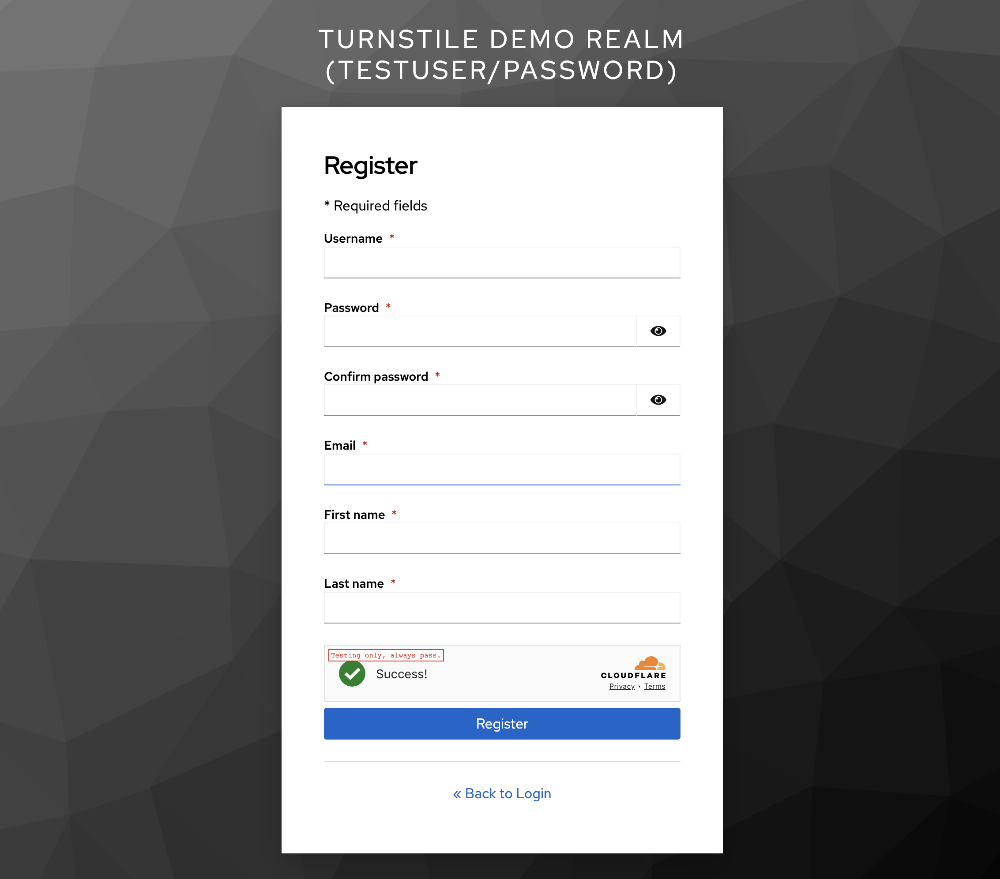

# Cloudflare Turnstile - Registration Support

This guide explains how to add Cloudflare Turnstile verification to user registration flows in Keycloak.

## Overview

Turnstile can protect your registration forms from bot signups and automated account creation. This provider offers **four implementation options**:


*Cloudflare Turnstile widget integrated into Keycloak registration form*

### Option 1: Separate Verification Page (Recommended)

A standalone verification page that appears before the registration form.

**User Experience:**
1. User clicks "Register" link on login page
2. **Turnstile verification page appears**
3. User completes the Turnstile challenge
4. User proceeds to registration form (username, email, password)
5. User completes registration

**Benefits:**
- Maximum bot protection (verify before form access)
- No theme modifications required
- Works with all themes
- Most stable approach

**Best for:** Production environments where security is priority

### Option 2: Script Injection (JavaScript-based)

Injects the Turnstile widget directly into the registration form via JavaScript.

**User Experience:**
1. User clicks "Register" link on login page
2. Registration form appears with Turnstile widget embedded before the submit button
3. User fills out registration form
4. User completes Turnstile challenge
5. User submits registration

**Benefits:**
- Seamless inline experience
- No theme modifications required
- Works with any theme that allows JavaScript

**Considerations:**
- Requires JavaScript enabled
- May have CSP (Content Security Policy) compatibility issues
- Widget appears via DOM manipulation

**Best for:** Modern browsers with JavaScript enabled

### Option 3: Copied Template (Native Integration)

Uses a modified copy of the base register.ftl template with Turnstile natively embedded.

**User Experience:**
1. User clicks "Register" link on login page
2. Registration form appears with Turnstile widget natively embedded before the submit button
3. User fills out registration form
4. User completes Turnstile challenge
5. User submits registration

**Benefits:**
- Native template integration (like built-in reCAPTCHA)
- No JavaScript manipulation needed
- Clean FreeMarker template approach
- Widget is part of the original form render

**Considerations:**
- Requires maintaining a template copy (turnstile-register.ftl)
- Template must be updated when Keycloak updates base register.ftl
- Higher maintenance burden

**Best for:** Organizations comfortable maintaining template copies and preferring native integration over JavaScript injection

### Option 4: Custom Theme (Standard Keycloak Approach)

Uses a bundled custom theme that extends the base theme with Turnstile support.

**User Experience:**
1. User clicks "Register" link on login page
2. Registration form appears with Turnstile widget natively embedded before the submit button
3. User fills out registration form
4. User completes Turnstile challenge
5. User submits registration

**Benefits:**
- Standard Keycloak theme approach
- Can be extended by users for further customization
- Theme can be selected in Realm Settings
- Clean separation of concerns

**Considerations:**
- **Requires selecting the "cloudflare-turnstile" theme** in Realm Settings → Themes → Login Theme
- Theme must be kept in sync with Keycloak updates
- Less flexible for mixed environments (some realms with Turnstile, some without)

**Best for:** Organizations that want a standard Keycloak theme approach and don't mind selecting a custom theme per realm

---

## Comparison Matrix

### Quick Comparison

| Feature | Option 1: Separate Page | Option 2: Script Injection | Option 3: Copied Template | Option 4: Custom Theme |
|---------|------------------------|----------------------------|---------------------------|------------------------|
| **Theme Selection Required** | ❌ No | ❌ No | ❌ No | ✅ Yes (select "cloudflare-turnstile") |
| **JavaScript Required** | ❌ No | ✅ Yes | ❌ No | ❌ No |
| **Template Maintenance** | ✅ None | ✅ None | ⚠️ Update on Keycloak upgrade | ⚠️ Update on Keycloak upgrade |
| **Inline Widget** | ❌ No (separate page) | ✅ Yes | ✅ Yes | ✅ Yes |
| **CSP Compatibility** | ✅ Excellent | ⚠️ May have issues | ✅ Excellent | ✅ Excellent |
| **Works Without JavaScript** | ✅ Yes | ❌ No | ✅ Yes | ✅ Yes |
| **Multi-Realm Flexibility** | ✅ High | ✅ High | ✅ High | ⚠️ Medium (theme per realm) |
| **Security Level** | ⭐⭐⭐⭐⭐ (verify first) | ⭐⭐⭐⭐ (inline) | ⭐⭐⭐⭐ (inline) | ⭐⭐⭐⭐ (inline) |
| **Setup Complexity** | ⭐ Simple | ⭐ Simple | ⭐ Simple | ⭐⭐ Moderate (theme selection) |
| **Keycloak-Native Approach** | ⭐⭐⭐ | ⭐⭐ | ⭐⭐⭐ | ⭐⭐⭐⭐ |

### Decision Flowchart

```
Start: Choose Registration Protection Option
│
├─ Do you already use custom Keycloak themes?
│  ├─ Yes → Consider Option 4 (Custom Theme)
│  └─ No → Continue...
│
├─ Is JavaScript guaranteed to work in your environment?
│  ├─ No (strict CSP, JS disabled, etc.) → Use Option 1 or Option 3
│  └─ Yes → Continue...
│
├─ Do you want maximum security (verify before form access)?
│  ├─ Yes → Use Option 1 (Separate Page) ⭐ RECOMMENDED
│  └─ No → Continue...
│
├─ Are you comfortable maintaining template copies?
│  ├─ Yes → Use Option 3 (Copied Template)
│  └─ No → Use Option 2 (Script Injection)
```

### Detailed Trade-offs

#### Option 1: Separate Verification Page

**Pros:**
- ✅ Maximum bot protection (verify before form access)
- ✅ Works everywhere (no JS, no theme, no CSP issues)
- ✅ No template maintenance
- ✅ Most stable across Keycloak upgrades
- ✅ Clear separation of security and registration

**Cons:**
- ❌ Extra page navigation (slight UX friction)
- ❌ Widget not inline with form
- ❌ Users see verification before seeing registration form

**Best for:** Production environments prioritizing security and stability

#### Option 2: Script Injection

**Pros:**
- ✅ Seamless inline UX
- ✅ No theme selection required
- ✅ No template maintenance
- ✅ Works with any theme
- ✅ Widget embedded naturally in form

**Cons:**
- ❌ Requires JavaScript enabled
- ❌ May have CSP (Content Security Policy) compatibility issues
- ❌ Widget appears after page load (brief delay)
- ❌ DOM manipulation approach (less "clean")

**Best for:** Modern web applications with JavaScript-enabled users

#### Option 3: Copied Template

**Pros:**
- ✅ Native FreeMarker template integration
- ✅ No JavaScript manipulation needed
- ✅ No theme selection required
- ✅ Widget rendered server-side
- ✅ Works like built-in reCAPTCHA

**Cons:**
- ❌ Template copy must be maintained
- ❌ Needs updating when Keycloak updates base template
- ❌ Higher maintenance burden
- ❌ Template bundled in JAR (not easily customizable by users)

**Best for:** Organizations comfortable maintaining template copies

#### Option 4: Custom Theme

**Pros:**
- ✅ Standard Keycloak theme approach
- ✅ Can be extended/customized by users
- ✅ Clean separation via theme
- ✅ Most "Keycloak-native" approach
- ✅ Users can create their own theme variants

**Cons:**
- ❌ **Requires theme selection** (must select "turnstile" theme)
- ❌ Less flexible for multi-realm with mixed requirements
- ❌ Theme must be kept in sync with Keycloak updates
- ❌ Additional configuration step

**Best for:** Organizations using standard Keycloak theme workflows

---

## Quick Start

### Prerequisites

- Cloudflare Turnstile site key and secret key ([Get keys](https://developers.cloudflare.com/turnstile/))
- Keycloak 24.0+ with the Turnstile provider installed
- Registration enabled in your realm

### Option 1: Separate Verification Page

**Step 1: Navigate to Registration Flow**

1. Select your realm in Keycloak Admin Console
2. Go to **Authentication** → **Flows**
3. Find **Registration** flow (or duplicate it to create a custom version)

**Step 2: Add Turnstile Authenticator**

4. Click **Add execution**
5. Select **"Cloudflare Turnstile (Registration)"** from the dropdown
6. The new execution will appear in the flow

**Step 3: Configure Position**

7. Drag the Turnstile execution to be **before** "Registration Page Form"
8. This ensures verification happens on a separate page first

**Step 4: Set Requirement**

9. Click the **Actions** menu (⋮) next to Turnstile execution
10. Select **REQUIRED**

**Step 5: Configure Settings**

11. Click **⚙️ Settings** (gear icon) next to the execution
12. Enter your site key, secret key, and other configuration
13. Click **Save**

**Step 6: Test**

1. Navigate to your Keycloak login page
2. Click **Register** link
3. You should see the Turnstile verification page
4. Complete the challenge
5. You'll be redirected to the registration form

### Option 2: Script Injection (Inline Widget)

**Step 1: Navigate to Registration Flow**

1. Select your realm in Keycloak Admin Console
2. Go to **Authentication** → **Flows**
3. Find **Registration** flow
4. Expand the **Registration form** subflow

**Step 2: Add Script Injection Action**

5. Click **Add execution** within the "Registration form" subflow
6. Select **"Cloudflare Turnstile (Script Injection)"** from the dropdown
7. The new FormAction will appear in the subflow

**Step 3: Configure Position**

8. The FormAction should be in the "Registration form" subflow
9. Order doesn't matter for FormActions (they all execute before form display)

**Step 4: Set Requirement**

10. Click the **Actions** menu (⋮) next to the Script Injection action
11. Select **REQUIRED**

**Step 5: Configure Settings**

12. Click **⚙️ Settings** (gear icon) next to the execution
13. Enter your site key, secret key, and other configuration
14. Click **Save**

**Step 6: Test**

1. Navigate to your Keycloak login page
2. Click **Register** link
3. You should see the registration form with Turnstile widget embedded before the submit button
4. Fill out the form and complete the Turnstile challenge
5. Submit registration

**Important Notes for Option 2:**
- The widget is injected via JavaScript after the page loads
- Check browser console for any JavaScript errors
- If using strict Content Security Policy (CSP), you may need to allow `https://challenges.cloudflare.com`

### Option 3: Copied Template (Native Integration)

**Step 1: Navigate to Registration Flow**

1. Select your realm in Keycloak Admin Console
2. Go to **Authentication** → **Flows**
3. Find **Registration** flow
4. Expand the **Registration form** subflow

**Step 2: Add Copied Template Action**

5. Click **Add execution** within the "Registration form" subflow
6. Select **"Cloudflare Turnstile (Copied Template)"** from the dropdown
7. The new FormAction will appear in the subflow

**Step 3: Configure Position**

8. The FormAction should be in the "Registration form" subflow
9. Order doesn't matter for FormActions (they all execute before form display)

**Step 4: Set Requirement**

10. Click the **Actions** menu (⋮) next to the Copied Template action
11. Select **REQUIRED**

**Step 5: Configure Settings**

12. Click **⚙️ Settings** (gear icon) next to the execution
13. Enter your site key, secret key, and other configuration
14. Click **Save**

**Step 6: Test**

1. Navigate to your Keycloak login page
2. Click **Register** link
3. You should see the registration form with Turnstile widget natively embedded before the submit button
4. Fill out the form and complete the Turnstile challenge
5. Submit registration

**Important Notes for Option 3:**
- Uses a bundled template copy (turnstile-register.ftl) in the provider JAR
- Widget is rendered server-side as part of the template
- No JavaScript manipulation - native FreeMarker integration
- Template is based on Keycloak 24.0.5's base/login/register.ftl
- **Maintenance:** If Keycloak's base template changes in future versions, the bundled template may need updating

### Option 4: Custom Theme (Standard Keycloak Approach)

**Step 1: Select the Turnstile Theme**

1. Log in to Keycloak Admin Console
2. Select your realm
3. Go to **Realm Settings** → **Themes** tab
4. Under **Login Theme**, select **cloudflare-turnstile** from the dropdown
5. Click **Save**

**Step 2: Navigate to Registration Flow**

6. Go to **Authentication** → **Flows**
7. Find **Registration** flow
8. Expand the **Registration form** subflow

**Step 3: Add Custom Theme Action**

9. Click **Add execution** within the "Registration form" subflow
10. Select **"Cloudflare Turnstile (Custom Theme)"** from the dropdown
11. The new FormAction will appear in the subflow

**Step 4: Configure Position**

12. The FormAction should be in the "Registration form" subflow
13. Order doesn't matter for FormActions (they all execute before form display)

**Step 5: Set Requirement**

14. Click the **Actions** menu (⋮) next to the Custom Theme action
15. Select **REQUIRED**

**Step 6: Configure Settings**

16. Click **⚙️ Settings** (gear icon) next to the execution
17. Enter your site key, secret key, and other configuration
18. Click **Save**

**Step 7: Test**

1. Navigate to your Keycloak login page
2. Click **Register** link
3. You should see the registration form with Turnstile widget natively embedded before the submit button
4. Fill out the form and complete the Turnstile challenge
5. Submit registration

**Important Notes for Option 4:**
- **CRITICAL:** You must select the "cloudflare-turnstile" theme in Realm Settings → Themes → Login Theme
- Without selecting the theme, the widget will not appear (FormAction will set attributes, but standard register.ftl doesn't use them)
- Theme extends the base theme and only overrides register.ftl
- Uses standard Keycloak theme approach
- Theme is based on Keycloak 24.0.5's base/login theme
- **Maintenance:** If Keycloak's base theme changes in future versions, the bundled theme may need updating

---

## Configuration

### Required Settings

| Setting | Description | Example |
|---------|-------------|---------|
| **Site Key** | Your Cloudflare Turnstile site key (public) | `0x4AAA...example` |
| **Secret Key** | Your Cloudflare Turnstile secret key (private) | `0x4AAA...secret` |

### Widget Settings

| Setting | Options | Description |
|---------|---------|-------------|
| **Widget Mode** | `managed`, `non-interactive`, `invisible` | How the widget appears to users |
| **Widget Theme** | `auto`, `light`, `dark` | Visual theme |

**Widget Mode Explained:**

- **managed** (Recommended): Shows interactive challenge when needed, automatic for legitimate users
- **non-interactive**: Always visible but requires minimal interaction
- **invisible**: Runs completely in the background (auto-submits form)

### Security Settings

| Setting | Default | Description |
|---------|---------|-------------|
| **Record Verifications** | `true` | Store verification results in database for auditing |
| **IP Allowlist** | Private IPs | Comma-separated IPs/CIDRs to skip verification |
| **IP Blocklist** | (empty) | Comma-separated IPs/CIDRs to block immediately |
| **Fail Action** | `BLOCK` | What to do when verification fails: `BLOCK`, `ALLOW`, `REQUIRE_MFA` |
| **Fail Mode** | `FAIL_CLOSED` | Behavior when Cloudflare API is unreachable: `FAIL_CLOSED` (block) or `FAIL_OPEN` (allow) |

### Network Settings

| Setting | Default | Description |
|---------|---------|-------------|
| **Connect Timeout** | `5000` | Connection timeout in milliseconds |
| **Read Timeout** | `5000` | Read timeout in milliseconds |

---

## Configuration Examples

### Example 1: Basic Registration Protection

**Goal**: Simple bot protection for public registration

```
Site Key: YOUR_SITE_KEY
Secret Key: YOUR_SECRET_KEY
Widget Mode: managed
Widget Theme: auto
Record Verifications: true
IP Allowlist: (empty - verify everyone)
IP Blocklist: (empty)
Fail Action: BLOCK
Fail Mode: FAIL_CLOSED
```

**Behavior**:
- All users see Turnstile before registration
- Verification failures block registration
- API errors block registration (secure)

**Best for**: Public-facing applications

---

### Example 2: Internal Registration (Trusted Network)

**Goal**: Skip verification for office network, verify external users

```
Site Key: YOUR_SITE_KEY
Secret Key: YOUR_SECRET_KEY
Widget Mode: non-interactive
Widget Theme: auto
Record Verifications: true
IP Allowlist: 192.168.0.0/16,10.0.0.0/8
IP Blocklist: (empty)
Fail Action: BLOCK
Fail Mode: FAIL_CLOSED
```

**Behavior**:
- Office users (192.168.x.x, 10.x.x.x) skip Turnstile completely
- External users see minimal verification
- Failures block access

**Best for**: Corporate applications with VPN or office access

---

### Example 3: High Availability (Lenient)

**Goal**: Don't block users if Cloudflare is down

```
Site Key: YOUR_SITE_KEY
Secret Key: YOUR_SECRET_KEY
Widget Mode: managed
Widget Theme: auto
Record Verifications: true
IP Allowlist: (empty)
IP Blocklist: (empty)
Fail Action: BLOCK
Fail Mode: FAIL_OPEN
```

**Behavior**:
- Users see Turnstile verification
- Verification failures block registration
- **But if Cloudflare API is down, users can still register**

**Best for**: Applications where availability is more important than perfect bot protection

---

### Example 4: Block Known Bad Actors

**Goal**: Immediately block specific IP ranges

```
Site Key: YOUR_SITE_KEY
Secret Key: YOUR_SECRET_KEY
Widget Mode: managed
Widget Theme: auto
Record Verifications: true
IP Allowlist: (empty)
IP Blocklist: 203.0.113.0/24,198.51.100.50
Fail Action: BLOCK
Fail Mode: FAIL_CLOSED
```

**Behavior**:
- IPs in blocklist get immediate access denied (no Turnstile shown)
- All other IPs go through normal verification

**Best for**: When you've identified specific abuse sources

---

## Advanced Configuration

### Combining with Login Protection

You can use Turnstile for **both login and registration**:

**Login Flow:**
1. Add Turnstile authenticator **before** username/password form
2. Protects against credential stuffing attacks

**Registration Flow:**
1. Add Turnstile authenticator **before** registration form
2. Protects against bot signups

Both use the same configuration and share the same database for auditing.

### IP Allowlist Best Practices

**Default Value:**
```
10.0.0.0/8,172.16.0.0/12,192.168.0.0/16,127.0.0.0/8,::1/128,fc00::/7,fe80::/10
```

This skips verification for:
- Private networks (RFC 1918)
- Localhost
- IPv6 private addresses

**To customize:**
1. Identify your office/trusted network IPs
2. Add them to allowlist as CIDR ranges
3. Test from external network to ensure verification still works

**IPv6 Support:**
```
2001:db8::/32,2001:db9::/32
```

### IP Blocklist Best Practices

**When to use:**
- You've identified specific attacker IPs/ranges
- You want to block entire countries (requires CIDR lists)
- Temporary blocking during active attacks

**Important:**
- Allowlist takes precedence (if IP in both lists, allowlist wins)
- Use sparingly - can block legitimate users
- Consider geographic restrictions at firewall level instead

### Fail Mode Decision Tree

**Use FAIL_CLOSED when:**
- Security is critical
- You can tolerate brief registration outages
- Cloudflare uptime is acceptable (99.9%+)

**Use FAIL_OPEN when:**
- Registration availability is critical
- You have other anti-abuse measures
- Turnstile is "nice to have" not required

---

## Monitoring and Analytics

### Database Auditing

If `Record Verifications` is enabled, all verification attempts are stored in the `cloudflare_turnstile_check` table.

**View recent registrations:**
```sql
SELECT
    timestamp,
    ip_address,
    success,
    error_codes
FROM cloudflare_turnstile_check
WHERE realm_id = 'your-realm-id'
ORDER BY timestamp DESC
LIMIT 100;
```

**Registration success rate:**
```sql
SELECT
    COUNT(*) as total_attempts,
    SUM(CASE WHEN success THEN 1 ELSE 0 END) as successful,
    ROUND(100.0 * SUM(CASE WHEN success THEN 1 ELSE 0 END) / COUNT(*), 2) as success_rate
FROM cloudflare_turnstile_check
WHERE realm_id = 'your-realm-id'
  AND timestamp > NOW() - INTERVAL '7 DAYS';
```

**Failed registrations by IP:**
```sql
SELECT
    ip_address,
    COUNT(*) as failed_attempts,
    array_agg(DISTINCT error_codes) as error_types
FROM cloudflare_turnstile_check
WHERE realm_id = 'your-realm-id'
  AND success = false
  AND timestamp > NOW() - INTERVAL '24 HOURS'
GROUP BY ip_address
ORDER BY failed_attempts DESC
LIMIT 20;
```

See [DATABASE.md](DATABASE.md) for more queries.

### Keycloak Events

Turnstile verification results are also logged to Keycloak events:

**Event Details:**
- `cloudflare_turnstile_result`: success/failed/blocked_ip
- `ip_address`: Client IP address
- `error_code`: Specific error code if verification failed

**View in Admin Console:**
1. Navigate to **Events** → **Login Events**
2. Filter by user or time range
3. Look for registration events with Turnstile details

---

## Troubleshooting

### Registration Widget Not Appearing

**Symptoms**: Users see registration form but no verification page

**Causes & Solutions:**

1. **Turnstile execution not in flow**
   - Check: Authentication → Flows → Registration
   - Fix: Add Turnstile execution to the flow

2. **Execution set to DISABLED**
   - Check: Requirement setting for Turnstile execution
   - Fix: Set to REQUIRED or ALTERNATIVE

3. **Turnstile positioned after registration form**
   - Check: Order of executions in flow
   - Fix: Move Turnstile before "Registration Page Form"

4. **User's IP in allowlist**
   - Check: IP Allowlist configuration
   - Note: This is working as designed (allowlist skips verification)

---

### All Registrations Failing

**Symptoms**: Every user gets "Security verification failed"

**Debug Steps:**

1. **Check logs:**
   ```bash
   docker-compose logs keycloak | grep -i turnstile
   ```

2. **Verify secret key:**
   - Ensure secret key in config matches Cloudflare dashboard
   - Common mistake: Using site key instead of secret key

3. **Test API connectivity:**
   ```bash
   curl -X POST https://challenges.cloudflare.com/turnstile/v0/siteverify \
     -H "Content-Type: application/json" \
     -d '{"secret":"YOUR_SECRET","response":"test"}'
   ```

   Expected: `{"success":false,"error-codes":["invalid-input-response"]}`

   If connection fails: Check firewall/proxy settings

4. **Check database for errors:**
   ```sql
   SELECT error_codes, COUNT(*)
   FROM cloudflare_turnstile_check
   WHERE success = false
     AND timestamp > NOW() - INTERVAL '1 HOUR'
   GROUP BY error_codes;
   ```

**Common Error Codes:**
- `invalid-input-secret`: Wrong secret key
- `timeout-or-duplicate`: Token expired (user took >5 min)
- `invalid-input-response`: Invalid token format

See [TROUBLESHOOTING.md](TROUBLESHOOTING.md) for complete error code reference.

---

### Widget Shows But Verification Fails

**Symptoms**: Widget loads and user completes challenge, but registration fails

**Possible Causes:**

1. **Site key doesn't match realm**
   - Widget uses site key, server uses secret key
   - Ensure both keys are from the same Turnstile site in Cloudflare dashboard

2. **Domain mismatch**
   - Turnstile site configured for `auth.example.com`
   - Users accessing via `localhost` or different domain
   - Fix: Add all domains to Turnstile site configuration in Cloudflare

3. **Clock skew**
   - Server time differs from Cloudflare significantly
   - Fix: Ensure NTP is configured correctly

---

### Widget Not Loading (JavaScript Errors)

**Symptoms**: Browser console shows errors loading Turnstile script

**Check:**

1. **HTTPS required**
   - Turnstile only works over HTTPS
   - Fix: Enable HTTPS or use reverse proxy

2. **Content Security Policy (CSP)**
   - Check browser console for CSP violations
   - Fix: Add to CSP headers:
     ```
     script-src 'self' https://challenges.cloudflare.com;
     frame-src 'self' https://challenges.cloudflare.com;
     ```

3. **Firewall blocking Cloudflare**
   - Some corporate firewalls block challenges.cloudflare.com
   - Fix: Whitelist domain or use IP allowlist for office network

---

## Testing Turnstile

### Using Cloudflare Test Keys

For development/testing, use Cloudflare's dummy keys that always pass:

```
Site Key: 1x00000000000000000000AA
Secret Key: 1x0000000000000000000000000000000AA
```

These keys:
- Always return success
- Don't require real user interaction
- Useful for integration testing
- **Never use in production!**

### Testing Fail Scenarios

To test failure handling:

1. **Use invalid secret key**
   - Temporarily set wrong secret key
   - Attempt registration
   - Should see "Security verification failed"

2. **Use expired token**
   - Complete Turnstile challenge
   - Wait 6+ minutes
   - Submit registration form
   - Should fail with timeout error

3. **Test API failure**
   - Temporarily block challenges.cloudflare.com in /etc/hosts
   - Attempt registration
   - Behavior depends on Fail Mode setting

### Testing IP Allowlist/Blocklist

1. **Allowlist test:**
   - Add your IP to allowlist
   - Attempt registration
   - Should skip Turnstile completely

2. **Blocklist test:**
   - Add your IP to blocklist
   - Attempt registration
   - Should get immediate "Access denied"

---

## Migration from reCAPTCHA

If you're currently using reCAPTCHA for registration:

### Step 1: Install Turnstile Provider

Deploy the Turnstile provider JAR to Keycloak (see main [SETUP.md](SETUP.md))

### Step 2: Create Parallel Flow

1. Duplicate your registration flow
2. Name it "Registration with Turnstile"
3. Remove reCAPTCHA execution
4. Add Turnstile execution
5. Test the new flow

### Step 3: Switch Flows

1. Go to **Realm Settings** → **Login**
2. Change **Registration Flow** from old flow to new flow
3. Test registration

### Step 4: Monitor

1. Check database for verification results
2. Monitor Keycloak events for errors
3. Watch for user complaints

### Step 5: Remove reCAPTCHA

Once confident Turnstile is working:
1. Delete old registration flow
2. Remove reCAPTCHA provider JAR
3. Update documentation

---

## Security Considerations

### Token Validation

- All tokens are validated server-side
- Client-side widget is only for UX
- Tokens can only be used once
- Tokens expire after 5 minutes

### Database Storage

If `Record Verifications` is enabled:
- Includes IP addresses (personal data in some jurisdictions)
- Consider data retention policies
- Implement automatic cleanup of old records
- See [DATABASE.md](DATABASE.md) for retention strategies

### IP Allowlist Risks

**Security trade-offs:**
- Allowlisted IPs skip verification completely
- Attackers within trusted networks are not detected
- Compromised office networks can abuse registration

**Mitigations:**
- Use smallest possible CIDR ranges
- Regularly review allowlist
- Combine with other anti-abuse measures (email verification, rate limiting)

### Fail-Open Mode

When using `FAIL_OPEN`:
- Cloudflare API failures allow unverified registrations
- Essentially disables Turnstile during outages
- Monitor Cloudflare status: https://www.cloudflarestatus.com/
- Have alerting for verification failures

---

## Performance Optimization

### Invisible Mode

For fastest user experience:

```
Widget Mode: invisible
```

**Benefits:**
- Zero user interaction required
- Automatic verification in background
- Seamless registration flow

**Drawbacks:**
- Less effective against sophisticated bots
- May show challenge for suspicious traffic

### Connection Pooling

For high-volume registration:
- Default timeouts (5000ms) are usually fine
- Increase if you see timeout errors
- Monitor Turnstile verification times in database

### Caching Considerations

Turnstile responses cannot be cached:
- Each verification requires API call
- Tokens are single-use
- No benefit from CDN caching

---

## Compliance

### GDPR Considerations

If `Record Verifications` is enabled:
- IP addresses are personal data under GDPR
- Inform users in privacy policy
- Implement data retention limits
- Provide data deletion on request

**Example retention policy:**
```sql
-- Delete verifications older than 90 days
DELETE FROM cloudflare_turnstile_check
WHERE timestamp < NOW() - INTERVAL '90 DAYS';
```

### Accessibility (WCAG 2.1)

The separate page approach (Option 1):
- ✅ Keyboard accessible
- ✅ Screen reader compatible (Cloudflare provides ARIA labels)
- ✅ High contrast mode supported
- ✅ No time limits on challenge completion

**Best practices:**
- Use `widgetTheme: auto` for system theme matching
- Test with screen readers (NVDA, JAWS, VoiceOver)
- Provide alternative registration method for accessibility issues

---

## Support and Resources

### Documentation
- [Main Setup Guide](SETUP.md)
- [Configuration Reference](CONFIGURATION.md)
- [Database Queries](DATABASE.md)
- [Troubleshooting Guide](TROUBLESHOOTING.md)
- [API Reference](API.md)

### Cloudflare Resources
- [Turnstile Documentation](https://developers.cloudflare.com/turnstile/)
- [Turnstile Dashboard](https://dash.cloudflare.com/)
- [Status Page](https://www.cloudflarestatus.com/)

### Getting Help
- GitHub Issues: [Report a bug](https://github.com/zymlabs/keycloak-cloudflare-turnstile/issues)
- Check existing docs in `/docs` directory
- Review Keycloak logs for specific errors

---

## Technical Trade-offs

### Performance Characteristics

| Aspect | Option 1 | Option 2 | Option 3 | Option 4 |
|--------|----------|----------|----------|----------|
| **Page Load Time** | Fast (separate page) | Fast + JS overhead | Fast | Fast |
| **Widget Render** | Server-side | Client-side (after DOM load) | Server-side | Server-side |
| **Total User Time** | +1 page navigation | Inline (no extra nav) | Inline (no extra nav) | Inline (no extra nav) |
| **Network Requests** | 2 pages | 1 page + JS | 1 page | 1 page |

### Browser Compatibility

| Requirement | Option 1 | Option 2 | Option 3 | Option 4 |
|-------------|----------|----------|----------|----------|
| **JavaScript** | Not required | **Required** | Not required | Not required |
| **Modern Browser** | Any browser | Modern (ES6+) | Any browser | Any browser |
| **CSP Restrictions** | Works with strict CSP | May require CSP adjustments | Works with strict CSP | Works with strict CSP |
| **No-JS Users** | ✅ Supported | ❌ Not supported | ✅ Supported | ✅ Supported |

### Upgrade Complexity

When Keycloak releases a new version:

**Option 1 (Separate Page):**
- ✅ **Low impact** - Uses separate template, unlikely to break
- Template: `turnstile-registration-form.ftl` (custom, standalone)

**Option 2 (Script Injection):**
- ✅ **Low impact** - No template dependencies
- Only affected if Keycloak changes form structure drastically

**Option 3 (Copied Template):**
- ⚠️ **Medium-High impact** - Must diff and merge template changes
- Template: `turnstile-register.ftl` (copy of base `register.ftl`)
- Action: Compare base template changes and update copy

**Option 4 (Custom Theme):**
- ⚠️ **Medium-High impact** - Theme must be updated
- Template: `theme/cloudflare-turnstile/login/register.ftl`
- Action: Compare base template changes and update theme

### Multi-Realm Deployments

**Scenario 1: All realms need Turnstile**
- **Best:** Option 1, 2, or 3 (configure per realm in auth flow)
- **Works:** Option 4 (but must set theme for each realm)

**Scenario 2: Mixed (some realms with Turnstile, some without)**
- **Best:** Option 1, 2, or 3 (enabled/disabled per realm)
- **Not ideal:** Option 4 (theme applies to entire realm, harder to mix)

**Scenario 3: Different configurations per realm**
- **Best:** Option 1, 2, or 3 (separate auth flow configs)
- **Works:** Option 4 (but shares same theme code)

---

## Migration Guide

### Switching Between Options

#### From Option 1 → Option 2, 3, or 4

**Steps:**
1. Keep Option 1 authenticator **DISABLED** (don't remove yet)
2. Add new option's execution to Registration form subflow
3. Configure with same settings
4. Test thoroughly
5. Remove Option 1 authenticator

**Configuration reuse:** Site key, secret key, and all settings transfer directly

#### From Option 2 → Option 1, 3, or 4

**Steps:**
1. Add new option's execution
2. Copy configuration from Option 2
3. Test
4. Disable Option 2 FormAction
5. Remove Option 2 when confirmed working

**Note:** Moving from inline (Option 2) to separate page (Option 1) changes UX significantly

#### From Option 3 or 4 → Different Option

**Steps:**
1. Add new option's execution
2. Copy configuration
3. Test thoroughly
4. Remove old option
5. If leaving Option 4: Change Login Theme back to base or another theme

**Template cleanup:** Old templates remain in JAR but won't be used

### Testing Multiple Options Simultaneously

**Can you run multiple options at once?**

✅ **Yes**, but only ONE should be REQUIRED at a time:

```
Registration Form (subflow)
├── Option 1 (DISABLED)
├── Option 2 (REQUIRED)  ← Currently active
├── Option 3 (DISABLED)
└── Option 4 (DISABLED)
```

This allows:
- Easy A/B testing by toggling REQUIRED/DISABLED
- Quick rollback if issues occur
- Gradual migration with safety net

**Important:** Don't set multiple to REQUIRED simultaneously (double verification!)

### Configuration Migration Checklist

When switching options:

- [ ] Note current configuration (site key, secret key, widget mode, etc.)
- [ ] Test new option in test/staging environment first
- [ ] Verify widget appears correctly
- [ ] Test successful registration
- [ ] Test failed verification (wrong/missing token)
- [ ] Check database recording (if enabled)
- [ ] Review Keycloak events
- [ ] Document which option you're using (for future reference)
- [ ] Update internal documentation

---

## What's Next?

After setting up registration protection, consider:

1. **Enable login protection** - Add Turnstile to browser flow
2. **Configure monitoring** - Set up queries for anomaly detection
3. **Implement rate limiting** - Combine with Keycloak's brute force protection
4. **Add email verification** - Layer multiple anti-abuse measures
5. **Review analytics** - Regularly check verification success rates

Your registration flow is now protected! 🎉
